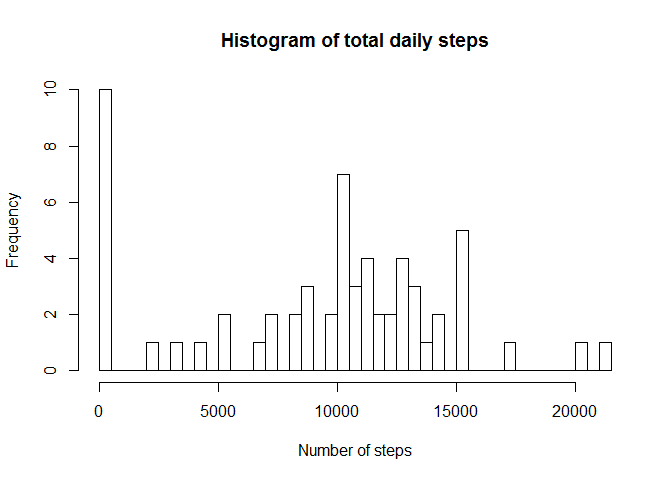
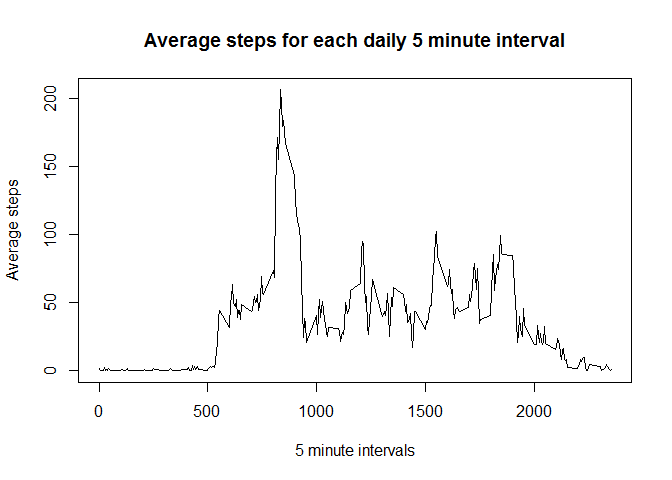
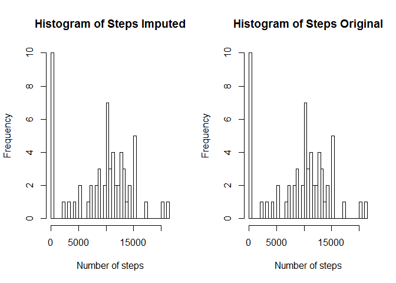

#### Notes: The following code must be run from the folder where the *activity.csv* file resides.

## Loading and preprocessing the data  
colClasses is specified to automatically convert the *date* variable to a Date format, and *steps* and *interval* to integers. As shown when the structure of *activity* is examined.  

```r
activity <- read.csv("activity.csv", colClasses=c("integer", "Date", "integer"), header=TRUE)
str(activity)
```

```
## 'data.frame':	17568 obs. of  3 variables:
##  $ steps   : int  NA NA NA NA NA NA NA NA NA NA ...
##  $ date    : Date, format: "2012-10-01" "2012-10-01" ...
##  $ interval: int  0 5 10 15 20 25 30 35 40 45 ...
```


## What is mean total number of steps taken per day  
*Missing values are ignored for this question*.  

1. Calculate the total number of steps taken per day

```r
steptotals <- with(activity, tapply(steps, date, sum, na.rm=TRUE))
```

2. Make a histogram of the total number of steps taken each day

```r
hist(steptotals, breaks=nrow(steptotals), xlab="Number of steps", main="Histogram of total daily steps")
```

<!-- -->

3. Calculate the mean and the median of the total number of steps taken each day


```r
mean <- mean(steptotals)
median <- median(steptotals)
```
  
The mean is 9354.2295082, and the median is 10395.  

## What is the average daily activity pattern?
*We will be using the "dplyr" package to answer this question, and missing values will again be ignored*.  

1. Make a time series plot (i.e. type = "l") of the 5-minute interval (x-axis) and the average number of steps taken, averaged across all days (y-axis)

```r
library(dplyr, warn.conflicts=FALSE)
intervals <- activity %>% na.omit() %>% group_by(interval) %>% summarise(average=mean(steps))
with(intervals, plot(interval, average, type="l", xlab="5 minute intervals", ylab="Average steps", main="Average steps for each daily 5 minute interval"))
```

<!-- -->

2.Which 5-minute interval, on average across all the days in the dataset, contains the maximum number of steps?


```r
max <- intervals[which.max(intervals$average),]
```

Interval 835 had the average maximum number of steps.  

## Imputing missing values  

1. Calculate the number of missing values

```r
missing <- colSums(is.na(activity))
missing
```

```
##    steps     date interval 
##     2304        0        0
```
There are 2304 missing values in the *steps* variable. The *date* and *interval* variables do not have any missing values.  

2. Mising values are going to be replaced with the mean for that interval over all days as calcualted above in the variable *intervals*, using the following function *impute_mean*.  

```r
impute_mean <- function(df)
{
    for(i in 1:nrow(df))
    {
        if (is.na(df[i,]$steps))
        {
            df[i,]$steps <- intervals[intervals$interval==df[i,]$interval,]$average
        }
    }
    df
}
```

3. Create new data set with NA imputed using the impute_mean function above

```r
imputed <- impute_mean(activity)
colSums(is.na(imputed))
```

```
##    steps     date interval 
##        0        0        0
```
Note that there are no missing values in the *imputed* data frame.  

4. Compare the steps summed over all date for the imputed and non-imputed data  

```r
imputed_steptotals <- with(activity, tapply(steps, date, sum, na.rm=TRUE))
par(mfrow=c(1,2))
hist(imputed_steptotals, breaks=nrow(steptotals), xlab="Number of steps", main="Histogram of Steps Imputed")
hist(steptotals, breaks=nrow(steptotals), xlab="Number of steps", main="Histogram of Steps Original")
mtext("Histogram of total daily steps", side = 3, line = 0, outer = TRUE, font=2)
```

<!-- -->

As expected because the missing values were imputed using the mean steps per interval, the two histograms are **identical**.  

## Are there differences in activity patterns between weekdays and weekends? 
The "lubridate" and "lattice" packages will be used to answer this question.  

```r
library(lubridate, warn.conflicts = FALSE)
library(lattice)
imputed$wday <- as.factor(ifelse(wday(imputed$date) %in% c(1,7), "weekend", "weekday"))
intervals_wday <- imputed %>% group_by(interval, wday) %>% summarise(average=mean(steps))
xyplot(average~interval|wday, data=intervals_wday, type="l", xlab="Intervals", ylab="Number of steps", layout=c(1,2))
```

<!-- -->
  
There are definitely differences in the patterns between weekday and weekends.  
